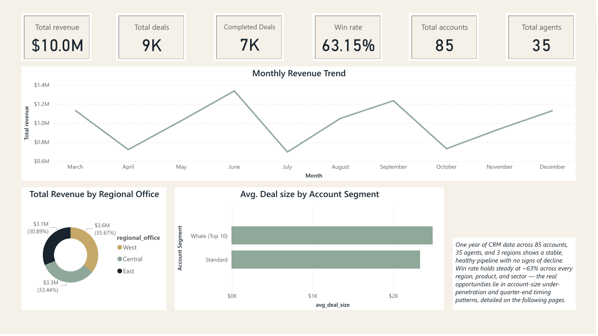

# CRM Sales Pipeline Analysis — Diagnosis & Growth Opportunities

**End-to-end BA project analyzing a year of CRM pipeline data — finding that win rate is a red herring across the board, while account size and quarter-end timing hide real, actionable revenue opportunities.**

Excel · MySQL/MariaDB · Power BI · DAX



## Overview

This project analyzes one year (2017) of CRM sales pipeline data — 8,800 opportunities across 85 accounts, 7 products, 35 sales agents, and 3 regional offices — structured around a real client brief: which agents/regions are winning and why, where deals stall in the pipeline, which products and sectors drive revenue, whether account size affects outcomes, and whether anything is quietly costing the business money.

Working from raw CSVs with no built-in relational keys, I designed the schema, validated every metric in SQL before rebuilding it in Power BI, and paired each finding with a specific, prioritized recommendation rather than stopping at description. The final deliverable is a 4-page interactive Power BI dashboard — Overview, Regional Performance, Agent Performance, and Account Segment — each built on a shared, validated data model.

## Key Findings

- **Win rate is a dead end, everywhere.** Region, product, and sector all sit in a tight 60–65% win-rate band. None of them explain performance differences — chasing a "win rate problem" in any of these dimensions would be chasing a pattern that isn't there.
- **Every agent wins more at quarter-end — a lot more.** Win rate jumps to 78–83% in March/June/September/December, against a ~50% baseline the rest of the year, for all 30 agents with sufficient data. Quarter-end wins also take longer to close (65.7 vs. 38.4 days), pointing to deals batching up rather than being rushed. → *Recommendation: forecast off month-specific win rates, not one blended average, and confirm the cause with sales leadership.*
- **The top 10 accounts are dramatically under-sold.** They hold 40% of total account revenue — 5× the revenue of a standard account — yet buy deals only 6.6% larger. The same gap holds (9.6× revenue, 15.5% larger deals) even comparing large vs. small accounts *excluding* those top 10. → *Recommendation: dedicated, high-touch account expansion for the top 10; scalable upsell tactics for everyone else.*
- **No two high performers look alike.** The top revenue-generating agent wins by closing bigger deals faster, not by winning more often; the highest win-rate agent does the opposite — many smaller deals. → *Recommendation: coach each type differently, using two consistently balanced (not just extreme) agents as the realistic team benchmark.*
- **No signs of decline.** Every dimension checked came back stable or improving-with-effort — the findings above are growth levers on a healthy business, not fixes for a failing one.

## Tools & Skills

- **MySQL/MariaDB** — schema design with surrogate keys, window functions (`NTILE`, correlated subqueries), FK constraint debugging, data-quality remediation
- **Power BI** — relational data modeling, DAX measures (`CALCULATE`, `DIVIDE`, `AVERAGEX`, `RANKX`), interactive slicers, scatter/line/bar visuals
- **Analysis** — win-rate methodology (closed-deals-only denominator), percentile-based account segmentation, time-series/seasonality investigation, prioritized diagnosis-and-prescription reporting

## The Process

The raw CSVs had no shared IDs beyond a single opportunity identifier, so table relationships had to be built on cleaned name-matching (with a surrogate `account_id` added specifically to handle a self-referencing subsidiary column). Two real data issues surfaced and had to be resolved before the numbers could be trusted: a product-naming mismatch (`GTXPro` vs. `GTX Pro`) that would have silently broken revenue joins, and a foreign-key import failure caused by blank values loading as empty strings instead of `NULL`.

Every metric was calculated twice — once in SQL, once in DAX — as a deliberate cross-check. That process caught a real bug early on: an initial win-rate formula divided wins by *all* pipeline activity, including deals still open, which understated every agent's true conversion rate. The fix (restricting the denominator to closed deals only) changed several agents' rankings meaningfully once corrected.

The quarter-end seasonality finding — the strongest result in the project — only became visible at month-level granularity; the same data aggregated to quarters looked completely flat, which is itself a reminder that the right level of aggregation can determine whether a pattern is found or missed entirely.

## Full Case Study

For the complete write-up — full methodology, all four findings sections with supporting tables, cross-cutting synthesis, and prioritized recommendations — see [`docs/crm_sales_pipeline_analysis.pdf`](docs/crm_sales_pipeline_analysis.pdf).

## Repo Structure

```
├── sql/        → validated SQL queries for all findings
├── docs/       → full case study write-up
├── images/     → dashboard screenshots
└── power-bi/   → the Power BI (.pbix) file
```
